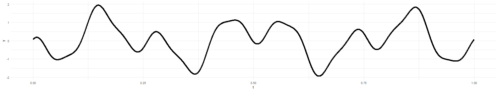
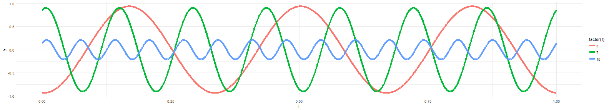
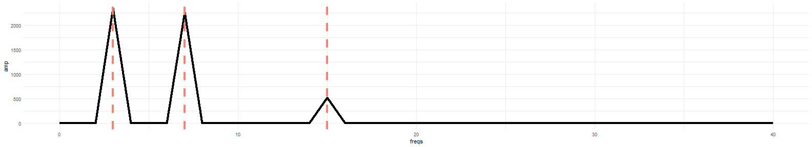
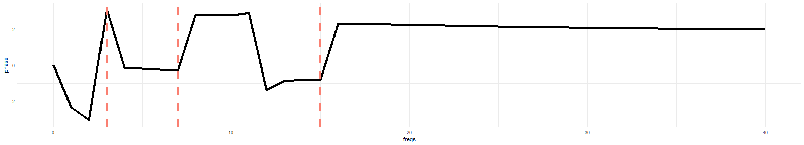

Shiny Fourier
========================================================
author: Anton Biryukov  
date: 13 October 2017
autosize: true

Purpose
========================================================
The purpose of this presentation is to give a brief intro for the Shiny app that it comes with.
The app demonstrates the concept of Fourier decomposition and transform. 

The theory says that a periodic continuous signal $S$ can be decomposed into a sum of harmonics:
$$
\begin{aligned}
S = \sum_{i}^{\inf} A_{i}sin(2 \pi f_{i}t + \phi_{i})
\end{aligned}
$$
- $A_{i}$ is the amplitude of the $i$-th harmonic  
- $f_{i}$ is the frequency of the $i$-th harmonic
- $\phi_{i}$ is the phase of the $i$-th harmonic

With this formula we can figure out what would a signal look like if it had components of 3, 7, and 15 Hz.

With Fourier transform we can ***figure out the inverse - what are the frequencies, amplitudes and phases of the harmonics for a given signal?***

Example of the signal (code)
========================================================
Here is the example of the signal that consists of 3 harmonics:


```r
library(dplyr)
library(ggplot2)
library(plotly)
getSinusoidal <- function(f,a,p,dt = 2e-4)
{
  t= seq(0,1,by=dt)
  y=a*sin(2*pi*f*t+p)
  return(data.frame(y=y,t=t,f=round(f,digits=2)))
}
sig.data <- function(f,A,p)
    {
    freqs <- c(3,7,15)
    amps <- runif(3,min=0.1,max =1)
    phase <- runif(3,min=0,max =2*pi)
    
    signal <-do.call('rbind',lapply(seq_along(freqs), function(x){getSinusoidal(freqs[x],amps[x],phase[x])}))
    return(signal)
}
# generate bins based on input$bins from ui.R
sig.df <- tbl_df(sig.data() )
full.sig <- sig.df %>% group_by(t) %>% summarise(y = sum(y),f=factor('Full Signal'))
```


Example of the signal (figure)
========================================================
Here is the example of the signal that consists of 3 harmonics:



And here it's components:




Fourier Transform
========================================================
And here's the result of the Fourier Transform - the amplitude and phase spectrum.

Pay attention to the peaks at the frequencies we used to construct the signal.


